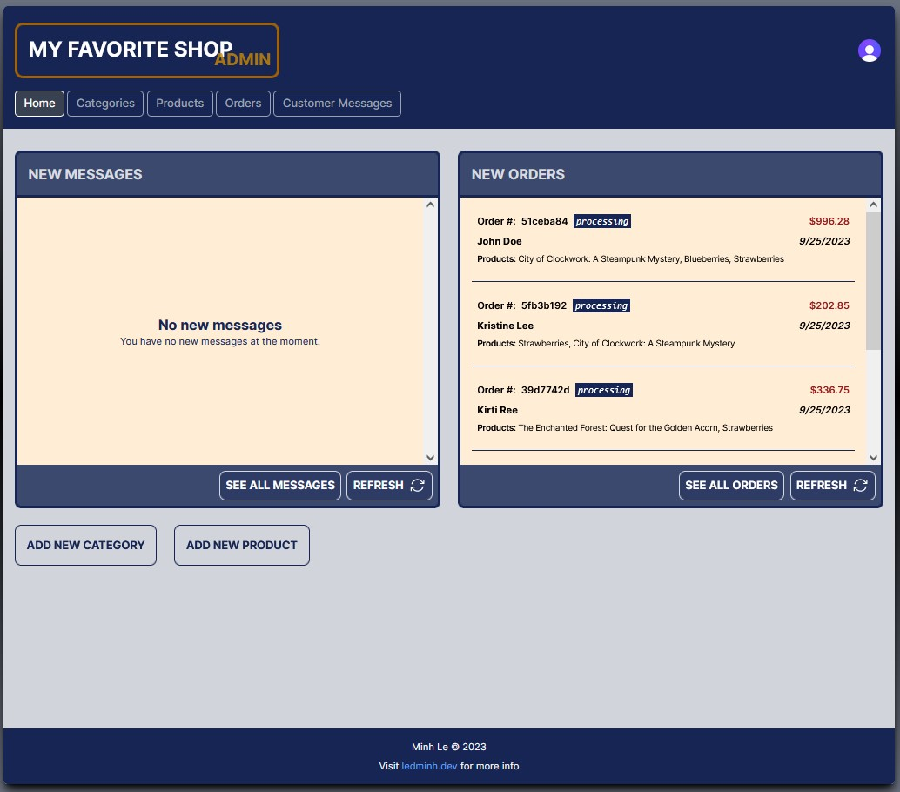

# My Favorite Shop - Third Iteration - Admin

This is the Admin Panel for the third iteration of the shop. You can find the user interface section [here](https://github.com/ledninh/my-favorite-shop).

## Technology Stack

- **Framework:** Next.js
- **Database:** Prisma, PostgreSQL
- **Authentication:** Clerk
- **Styles:** Tailwind CSS

## Screenshot



## Live Demo

- **URL:** [My Favorite Shop Admin](https://my-favorite-shop-admin.vercel.app)
- **Username:** store_admin
- **Password:** admin_54321

## Deployment Instructions

To deploy this project on your local machine, follow these steps:

1. Clone this project to your computer:

   ```sh
   git clone https://github.com/ledminh/nail-supply-shop-v2
   ```

2. Install dependencies:

   ```sh
   npm install
   ```

 3. If you haven't done so already, please follow steps (3), (4), (5), and (6) in the "Deployment Instructions" section of [this project](https://github.com/ledminh/my-favorite-shop). If you have already completed these steps, use the same values you generated during the deployment of that project and add them to the `.env` and `.env.local` files.
    
 5. Create a new account on Clerk, add a new application to acquire NEXT_PUBLIC_CLERK_PUBLISHABLE_KEY and CLERK_SECRET_KEY, then add them to your `.env.local` file.

 6. Add these two variables to your `.env.local` file:

    ```
    NEXT_PUBLIC_CLERK_AFTER_SIGN_IN_URL=/
    NEXT_PUBLIC_CLERK_SIGN_IN_URL=/sign-in
    ```

 7. Since this project uses Next.js, the remaining deployment process is similar to any other Next.js app. You can run the development server with the following command:

      ```sh
      npm run dev
      ```

 8. If you intend to deploy it to your own server, follow these steps:

   - Build the project:

     ```sh
     npm run build
     ```

   - Start the server:

     ```sh
     npm run start
     ```

## Continuing Development

Here's a list of tasks for the ongoing development of this project:

- Implement a customer login feature.
- Set up email confirmation for customers after checkout.
- Enhance the user interface.
- Incorporate additional animations to improve the user experience.
